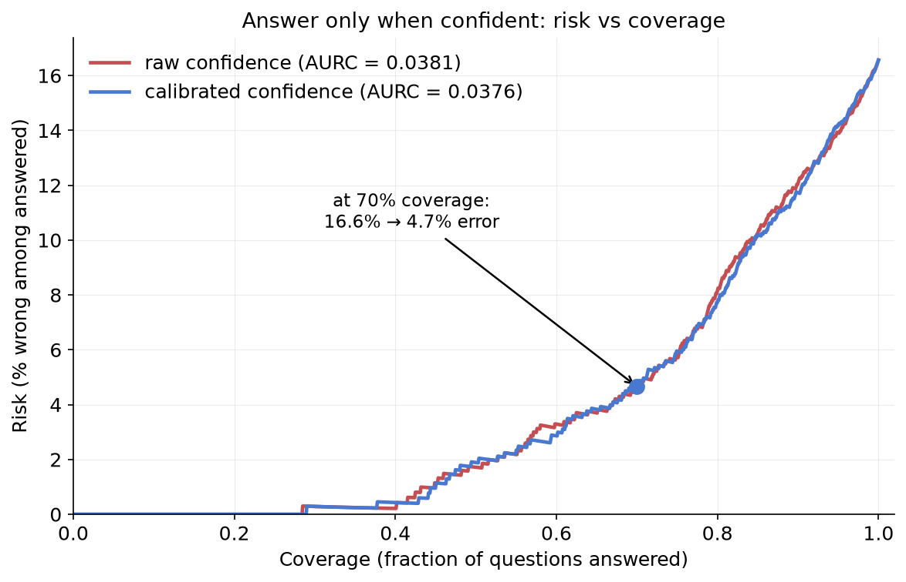
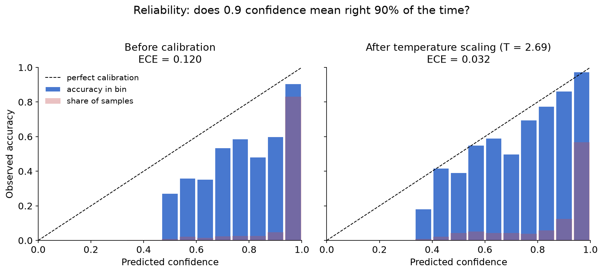

# uncertainty-gate

**Claim:** a model that attaches *calibrated, guarantee-backed* uncertainty to its answers — and abstains when unsure — becomes dramatically more reliable on the answers it does give. This repo proves it with one chart: the risk–coverage curve for Qwen2.5-3B-Instruct on ARC-Challenge, where **at 70% coverage, error drops from 16.6% (answer everything) to 4.7% (calibrated confidence gate)** — a 3.5× reduction — backed by a distribution-free conformal coverage guarantee that is verified empirically in-repo. Temperature scaling cuts the model's ECE from 0.120 to 0.032 (T = 2.69: the raw model is heavily overconfident).





## Quickstart

```bash
python -m venv .venv && source .venv/bin/activate
pip install -r requirements.txt        # or requirements-min.txt for the LLM-free tabular spine
python -m src.pipeline                 # figures + JSON land in outputs/
pytest                                 # the guarantee, tested
```

First run on `dataset: arc` downloads Qwen2.5-3B-Instruct and scores ~1.5k questions (cached to `outputs/cache/`; re-runs never touch the model). With `dataset: tabular` the whole pipeline runs in under a minute with no torch/transformers at all.

Artefacts written to `outputs/`:

| file | what it shows |
|---|---|
| `reliability.png` | reliability diagram + ECE, before/after temperature scaling |
| `coverage_check.json` | empirical conformal coverage ≈ 1 − α for LAC and APS |
| `risk_coverage.png` | risk vs coverage, raw vs calibrated confidence, AURC |
| `caught_examples.md` | confidently-wrong answers the layer flagged |
| `metrics.json` | every number above, machine-readable |

## How the guarantee works

Split conformal prediction: score every calibration point by how "nonconforming" the true label is, take the finite-sample-corrected (1 − α) quantile of those scores, and include in each test prediction set every label that scores below it — if calibration and test data are exchangeable, the set contains the true label with probability ≥ 1 − α, *no matter how wrong the model's probabilities are*. The entire construction is ~30 readable lines in [`src/conformal.py`](src/conformal.py), and [`tests/test_conformal.py`](tests/test_conformal.py) is the proof: over hundreds of random splits of deliberately miscalibrated synthetic data, mean empirical coverage lands on 1 − α to within Monte-Carlo noise.

## Config (`config.yaml`)

| key | default | meaning |
|---|---|---|
| `dataset` | `arc` | `arc` \| `mmlu` \| `tabular` (tabular = Covertype spine, no LLM) |
| `model_route` | `hf` | `hf` (local transformers) \| `api` (OpenAI-compatible logprobs endpoint) |
| `hf_model` | `Qwen/Qwen2.5-3B-Instruct` | any causal LM whose tokeniser has single-token A–D |
| `score_mode` | `letter` | `letter` (next-token logits over A–D) \| `cloze` (length-normalised option log-likelihood) |
| `alpha` | `[0.05, 0.10, 0.20]` | conformal miscoverage levels to sweep |
| `cal_frac` | `0.30` | calibration fraction when a dataset has no native split |
| `crosscheck` | `false` | verify the from-scratch conformal code against MAPIE |

## Repo map

```
src/
  data.py         # ARC / MMLU / Covertype loaders (4-option normalisation)
  scoring.py      # (N, 4) probability matrix from letter logits, cloze, or API — cached
  calibration.py  # temperature scaling, ECE, reliability data — from scratch
  conformal.py    # split conformal (LAC + APS), the whole guarantee
  selective.py    # risk-coverage, AURC, accuracy@coverage
  plots.py        # the two figures
  crosscheck.py   # optional MAPIE agreement check
  pipeline.py     # end-to-end orchestration
notebooks/demo.ipynb   # the same story, narrated
tests/                 # the claims, encoded as pytest
```

## Honest limitations

- The conformal guarantee is **marginal**: coverage ≥ 1 − α on average over the whole distribution, not per-topic or per-difficulty-slice (conditional coverage is impossible in general without assumptions).
- It rests on **exchangeability** of calibration and test data; under distribution shift the guarantee degrades.
- Correctness is **exact-match multiple choice** only — no free-form generation, no LLM judges. That is what makes every number in this repo unambiguous.
- With ARC's fixed calibration split of only 295 questions, per-run empirical coverage can fluctuate a few points around 1 − α (e.g. 0.76 at α = 0.20 in one run); the guarantee is marginal over calibration draws, which is exactly what `tests/test_conformal.py` verifies over hundreds of random splits.
